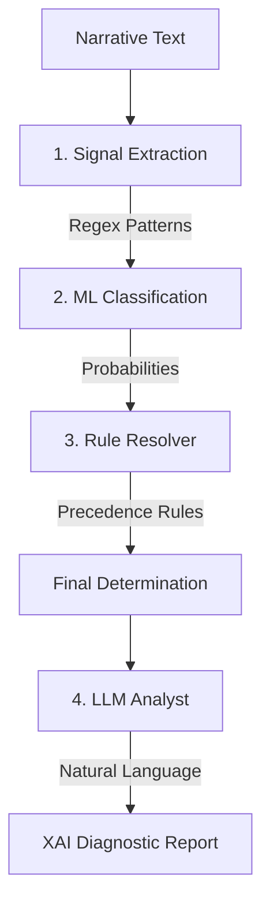

# Paranormix: Neural Investigation Log

Paranormix is a forensic analysis terminal designed to detect and classify patterns in paranormal narratives. It uses a hybrid approach combining deterministic pattern matching with machine learning to ensure both transparency and accuracy in its diagnostics.

---

## 🏗️ System Architecture

The analysis pipeline is structured into four sequential steps, following a **Hybrid Explainable AI (XAI)** philosophy:



### 1. Signal Extraction (Regex)
Identifies explicit keywords and indicators within the narrative. Provides direct interpretability for forensic markers (e.g., "knocking", "scratches").

### 2. ML Classification (Core Engine)
A trained **SGD Classifier** with balanced weights assigns probability scores to the narrative tiers. This layer handles linguistic ambiguity where explicit keywords might be missing.

### 3. Rule Resolver (Logic Layer)
A deterministic engine that resolves conflicts using a strict precedence hierarchy (e.g., Physical evidence overrides purely visual signals), ensuring stable determinations.

### 4. LLM Analyst (XAI)
A persona-driven analyst that explains the classification in plain language, strictly grounded in the technical evidence and confidence scores provided by the previous layers.

---

## 📊 Evaluation & Metrics

The model is trained on a **balanced dataset** featuring **1,000 samples per classification class**, ensuring the system is unbiased towards common signal types.

**Accuracy Baseline**: The system maintains an evaluation accuracy of **~65%** on complex, real-world narrative distributions, with high precision in the **Immaterial** and **Environmental** tiers.

Key metrics tracked:
- **Precision**: Accuracy of detected signals.
- **Recall**: Completeness of signal detection.
- **F1-Score**: Harmonic mean for balanced performance assessment.

---

## 🛠️ Setup and Operational Protocols

### Local Implementation
1. **Environment**:
   ```bash
   python -m venv .venv
   source .venv/bin/activate  # Windows: .venv\Scripts\activate
   pip install -r requirements.txt
   ```
2. **Configuration**: Create a `.env` file with `GROQ_API_KEY=your_key_here`.
3. **Execution**:
   ```bash
   uvicorn src.backend.main:app --reload
   ```

### Operational Map
- `src/ml/inference.py`: Signal extraction and ML probability layer.
- `src/ml/resolver.py`: Precedence-based decision logic.
- `src/backend/main.py`: API layer and Analyst orchestration.
- `src/scripts/evaluate.py`: Performance measurement suite.

---

*Developed for Machine Learning Diagnostic Research and AI Course Evaluation.*
