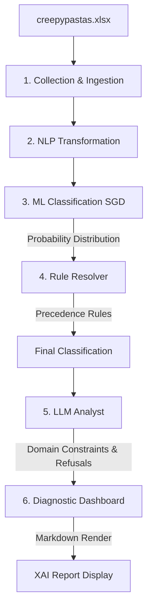

# Paranormix: Neural Investigation Log

Paranormix is a forensic analysis terminal designed to detect and classify patterns in paranormal narratives. It uses a hybrid approach combining deterministic pattern matching with machine learning to ensure both transparency and accuracy in its diagnostics. Developed in alignment with the **INT428 assessment criteria** for technical rigor, analytical persona alignment, and prompt engineering.

---

## 🏗️ System Architecture & Data Pipeline

The analysis pipeline maps the journey of narrative data from initial dataset to final visualization, relying on a **Hybrid Explainable AI (XAI)** philosophy:



### 1. Data Ingestion & Transformation 
Extracts texts directly from the `creepypastas.xlsx` dataset. Applies NLP rules (Regex, Lemmatization) to isolate forensic markers (e.g., "knocking", "scratches").

### 2. ML Classification (Core Engine)
A trained **SGD Classifier** evaluates the vector space to assign probability scores across the five narrative tiers.

### 3. Rule Resolver (Logic Layer)
A deterministic engine that resolves conflicts using a strict precedence hierarchy, ensuring stable and reliable determinations. 

### 4. LLM Analyst & Strict Refusal Policy
A persona-driven analyst rigorously restricted by **absolute refusal policies**. Any non-domain query entirely aborts the explanation phase. For valid domain queries, it generates an explanation grounded in evidence.

### 5. Diagnostic Dashboard (UI)
Translates the backend states into a visual suite. Features include rendering ML probability distributions, and clear Markdown rendering (using distinct blue-colored bold headers) for optimal academic readability and visualization.

---

## 📊 Evaluation & Metrics

The model is trained on a strictly **balanced dataset** featuring exactly **1,000 samples per classification class** (5,000 total samples), ensuring the system is unbiased towards common signal types.

**Accuracy Baseline**: The system maintains an evaluation accuracy of **~65%** on complex, real-world narrative distributions, with particularly high precision in the **Immaterial** and **Environmental** tiers.

---

## 🛠️ Setup and Operational Protocols

### Local Implementation
1. **Environment**:
   ```bash
   python -m venv .venv
   source .venv/bin/activate  # Windows: .venv\Scripts\activate
   pip install -r requirements.txt
   ```
2. **Configuration**: Create a `.env` file with `GROQ_API_KEY=your_key_here`.
3. **Execution**:
   ```bash
   uvicorn src.backend.main:app --reload
   ```

### Operational Map
- `src/ml/inference.py`: Signal extraction and ML probability layer.
- `src/ml/resolver.py`: Precedence-based decision logic.
- `src/backend/main.py`: API layer, LLM configuration, and strict refusal checks.
- `src/scripts/evaluate.py`: Performance measurement suite.

---

*Developed for Machine Learning Diagnostic Research and AI Course Evaluation (INT428).*
